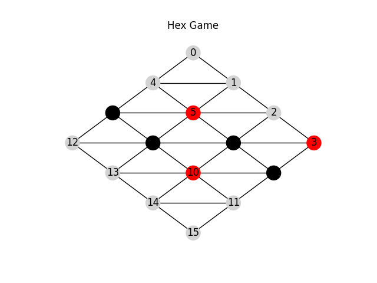

# Reinforcement Learning using Monte-Carlo Tree Search

A reinforcement learning system using Monte-Carlo Tree Search (MCTS) for learning and playing two-player games. This system uses Monte-Carlo Tree Search to simulate the continuation of a game a number of times for each move it makes. It uses these simulations during training to train an artificial neural network on giving the best actions given a game state.

In this system, two different two-player games and a tournament system are implemented to assess the learning capabilities of the system.

### Nim

The Nim game consists of two players taking turns drawing pieces from a pile. Each turn a player can draw either 1 or 2 pieces. The goal is to be the player who draws the last two pieces.

### Hex

The Hex game consists of an NxN board where each player takes turns placing pieces of their color on the board. The goal for the red player is to create a connecting line of pieces from the upper right to the lower left, while the black player tries to do the same but from the upper left to the lower right. The image below shows the game board where black has won after 4 turns (black started). Note that in the Hex game, the starting player is guaranteed a win with perfect play.

### TOPP

The tournament system, TOPP (Tournament of Progressive Policies), lets different agents play against each other. Their score is decided by how many of the other agents an agent is able to beat in a round of e.g. 24 games. During training, the system saves the weights of the Actor Network periodically. This lets us create agents with different skill levels. In a tournament, each agent plays every other agent a number of times. The agents with more training should perform better than the agents with low amounts of training.

## Usage

To run this program, download or clone the repository and run `gprl_system.py` using Python 3.9 or higher. As of writing this text, Tensorflow does not support Python 3.10 or higher.

## Requirements

- Python 3.9 or higher
- Tensorflow
- Numpy
- Matplotlib
- Configparser

`pip install tensorflow numpy matplotlib configparser`

## Configuration

Most settings, such as how long to train or the neural network's structure, can be changed in the config files. Examples for config files can be found in [`config/`](config/).

The syntax of the config files is identical to Windows' .ini-files' syntax, where variables are defined on separate lines with an equals-sign separating the variable and the value.

In the __RL__ section:

- __weights_path__: The path of the saved weights from a previous training session or the path to save weights to after training.
- __weights_index__: Not used
- __num_policies__: Number of policies to save during training
- __num_games__: Total number of games to play
- __epochs_per_episode__: Number of epochs to train the network for after each episode
- __epsilon__: Probability for picking a completely random move in an actual game
- __draw_board__: Whether or not to draw the board during training

In the __Actor__ section:

- __lrate__: Learning rate of the actor neural network
- __optimizer__: Which optimizer to use when training the network

In the __MCTS__ section:

- __sim_games__: How many games to simulate for each move made in an actual game
- __epsilon__: Probability for picking a completely random move in a simulated game

In the __Simworld__ section:

- __board_size__: Number of rows and columns in the Hex game

In the __TOPP__ section:

- __num_games_in_series__: Number of games in a series
- __draw_board__: Whether or not to draw the board during tournament play

## Results

For Hex boards of size 5 and lower the agent was able to learn the optimal strategy. For 4x4 Hex boards this took around 100 episodes with 500 simulation games per move. As it was able to learn the optimal strategy, a human player was not able to beat the agent if the agent got to make the first move. Otherwise, beating it is trivial as the starting player will always beat any player with perfect play.

In the tournament the agents with more training showed their skill level by being able to beat agents with little training easily. For some training sessions, it seemed like the skill level capped out after around 100 epochs as all agents saved after that point showed about the same skill level in the tournament.

## License

This code is protected under the [GNU General Public License 3.0](http://www.gnu.org/licenses/gpl-3.0.html)